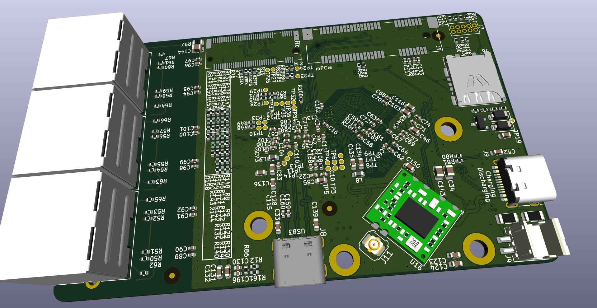

# OPR
Open pocket router

## Screenshots





## In developing!!!

If you have questions, write suggestions in `Issues`

## Description
TODO:

## Specification

- CPU: MT7621A
- RAM: 2Gbit DDR3 
- USB: 3.0
- ETH: 3xGbE (RJ45)
- Display: SSD1306-0.91
- Flash: W25Q256FVEIG
- PowerBank: IP5328P
- Connectors: M.2 (2xPCIe+UART); mPCIe (1xPCIe+I2C+USB2+UART)
- PCB: 6 layers; JLC06161H-3313; Epoxy Filled & Capped; 0.15mm/0.3mm Via 

## Supported modules

- WIFI: MT7612E (mPCIe)
- NVME: N930ES-512GB (M.2-2242)

## Changelog:

### v 0.1
- init

## Credit
```
https://github.com/kellertk/pwnagotchi-plugin-pisugar2
https://github.com/YC-Lammy/IP5328P-powerbank_design
https://github.com/zhaoxinyu0113/MT7621A_Router_HW_DIY'
https://github.com/cyijun/MT7621A-Router-Design
https://www.cnx-software.com/2015/05/14/firewrt-is-an-openwrt-802-11ac-board-powered-by-mediatek-mt7621a-processor/
https://bbs.t-firefly.com/forum.php?mod=viewthread&tid=543
http://en.techinfodepot.shoutwiki.com/wiki/Firefly_FireWRT
https://wikidevi.wi-cat.ru/MediaTek
https://whycan.com/t_2230.html
http://bbs.ntpcb.com/read-htm-tid-44619.html
https://www.elecfans.com/soft/21/2020/202003111179546.html
```